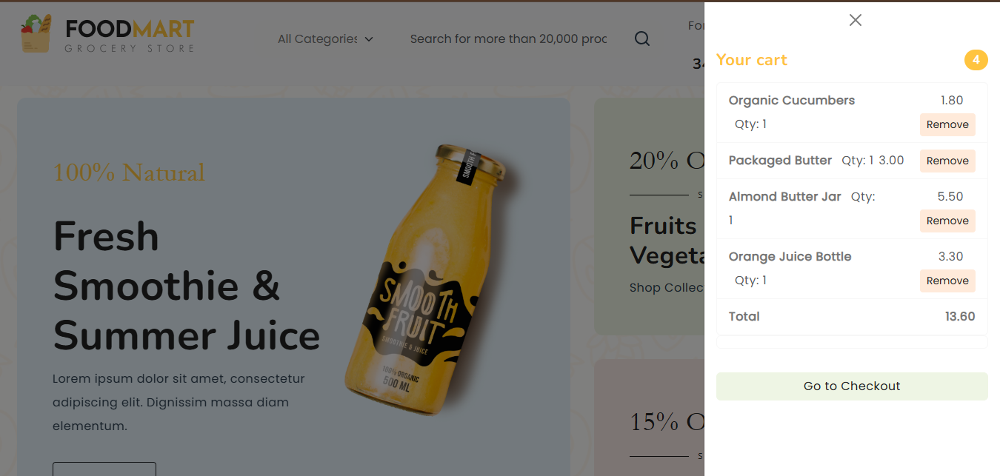
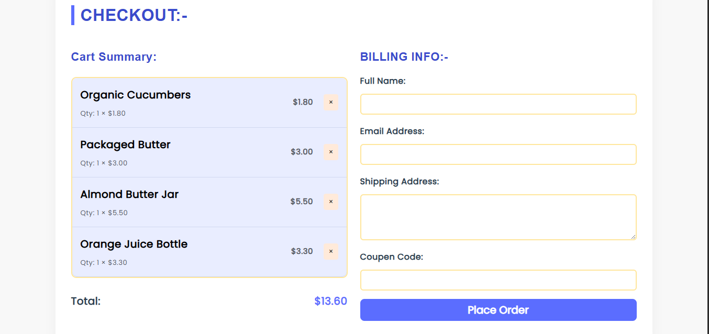

# 🛒 FoodMart Checkout Page

A clean, modern, and responsive **checkout and cart page** designed for online retail or grocery platforms. The project allows users to review their cart items, view total pricing, and submit customer billing details. The entire cart logic is handled using **JavaScript** and persisted using **LocalStorage**, making it ideal for static deployments.

---

## 🚀 Live Demo

🔗 **Deployed on Vercel**: 

👉 Link:- https://pr-add-to-cart-js.vercel.app/

---

## 📸 Screenshots

1. Main  Page 

 

2. Cart Summary

 

 3. Checkout Page

  

---

## 🌟 Features

- 🛍 **Live Cart Summary** with item name, quantity, and price
- 💵 **Real-time Total Price Calculation**
- 🧾 **Billing Form** for customer name, email, and shipping address
- ✅ **Cart Persistence** via `localStorage` across pages
- 📦 **Order Placement & Cart Clearing**
- 🎨 **Clean UI with Indigo-Blue Theme**
- 📱 **Fully Responsive** for mobile, tablet, and desktop

---

## 🧰 Technologies Used

| Technology     | Description                          |
|----------------|--------------------------------------|
| `HTML5`        | Page structure                       |
| `CSS3`         | Custom styling                       |
| `Bootstrap 5`  | Responsive layout and components     |
| `JavaScript ES6` | Dynamic cart logic and validation |
| `LocalStorage` | Client-side storage for cart data    |
| `Vercel`       | Hosting & deployment                 |

---

## 📁 Project Structure

foodmart-checkout/
├── index.html # Product page with Add to Cart
├── checkout.html # Checkout & Billing page
├── js/
│ └── script.js # Cart logic + LocalStorage handler
├── css/
│ └── style.css # Custom styles
├── assets/
│ └── product-images/ # Product images
├── screenshots/
│ ├── checkout-page.png # Checkout UI preview
│ └── cart-summary.png # Cart preview
└── README.md
---

